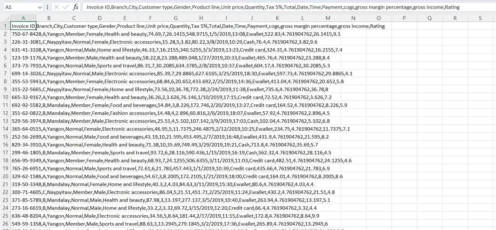
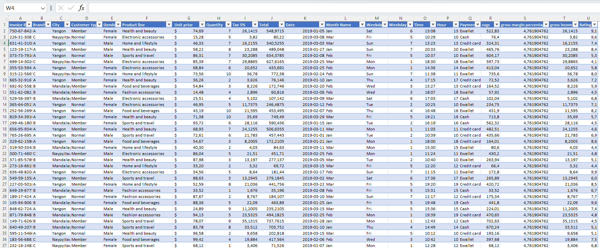
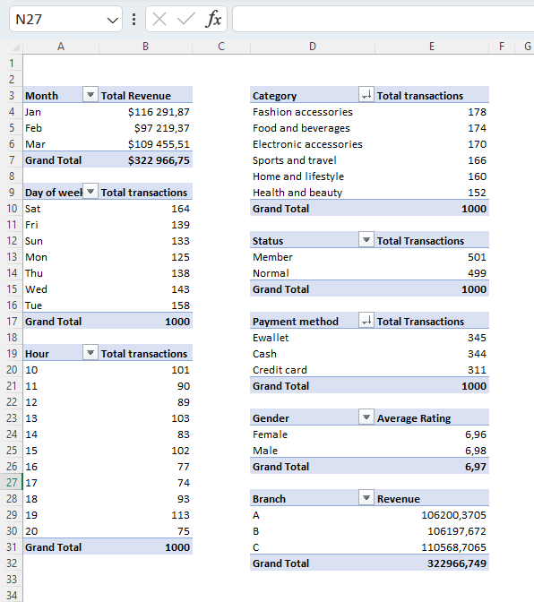
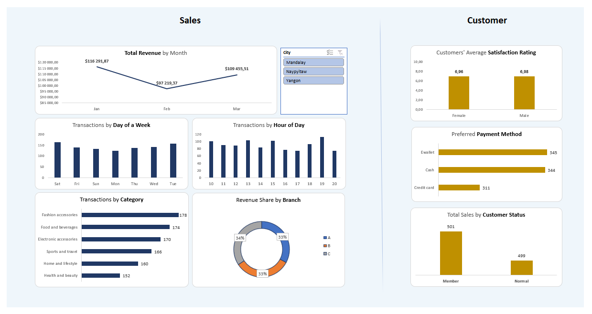
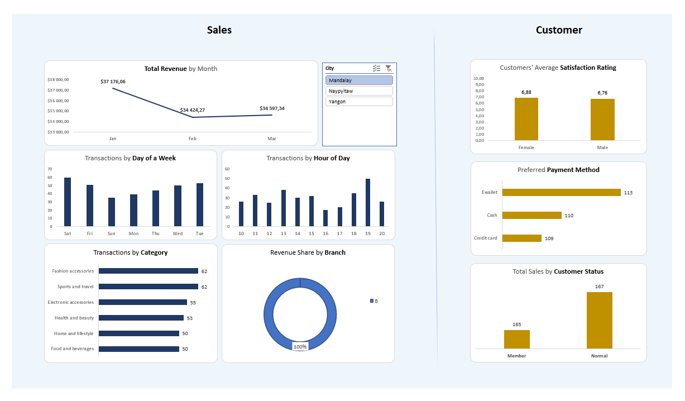
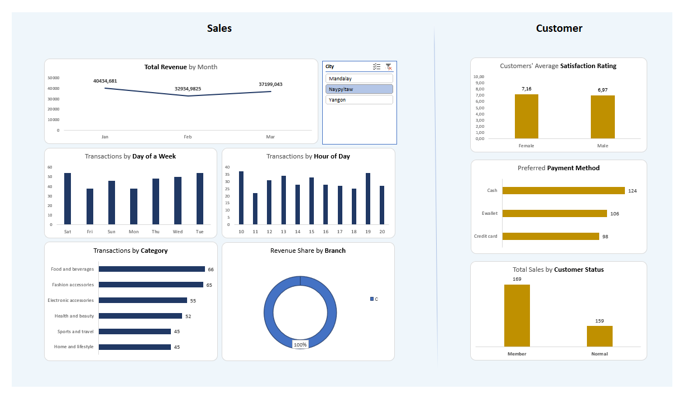
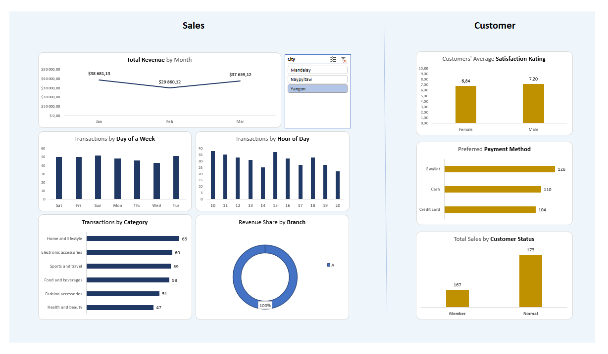

# Project Overview

 

This is a project based on scenario in which I received a request from Sales Manager of a Superstore to create report based on his needs.

### Data Source

- **Dataset**: "Supermarket sales"
- **Provided by**: AUNG PYAE
- [Dataset Link](https://www.kaggle.com/datasets/aungpyaeap/supermarket-sales/)

### Used Software and Technologies

- Microsoft Excel

 

## Business Request

The Sales Manager has requested the development of an interactive dashboard to monitor performance across three cities under his management. The primary objective is to gain insights into revenue trends over time, along with specific details such as:

- Identifying the busiest days and hours with the highest total transaction numbers.
- Analyzing the popularity of different product categories.
- Determining the contribution of each company branch to the total revenue.
- Additionally, the Sales Manager aims to assess customer satisfaction with the shopping experience, categorized by gender. The investigation extends to understanding customer preferences regarding payment methods and their participation in the loyalty program.

# Steps applied:

1. **Data Import**:

- Utilized Excel to open the supermarket_sales CSV file.
- Ensured correct data types, particularly for dates and currencies.
- Conducted outlier identification through the filter pane.
- Augmented the dataset with new columns featuring Month Name, Weekday, and Hour.

 

 

2. **Data Analysis**:

- Employed pivot tables to analyze data across various dimensions.

 

 

3. **Dashboard Development**:

- Created visually informative pivot charts.
- Implemented an intuitive design for the interactive dashboard.

 

- For all stores:

 

- For Mandalay store:

 

- For Naypyitaw store:

 

- For Yangon store:

 
